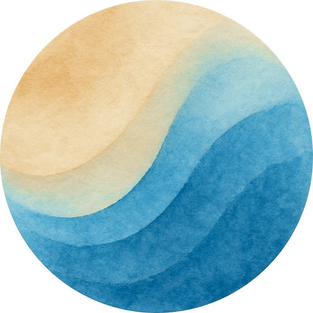

    

# Riviera theme

A two-tone pastel color theme

- [VSCode/Cursor](/vscode/)
- [Zed](/zed/)
- [iTerm2](/iterm2/)

## Color palette

`#e9e9ed` - Off-white - main editor text, variables, punctuation

`#8f92a3` - Gray - keywords, storage, operators  
`#505362` - Dark gray - comments, markdown quotes

`#09090b` - Black - activity bar, badge foreground  
`#101114` - Near-black - editor, sidebar, tabs, statusbar

`#77adc1` - Azure - strings, constants, badges, links  
`#9cc4d3` - Light azure - button hover, badges

`#f9c295` - Sand - function names, warnings, decorators  
`#fad0ad` - Light sand - logical/bitwise operators, CSS operators

`#dd6b6b` - Red - errors/deletions

### Terminal ANSI colors

`#454658` / `#585a6e` - Black  
`#fbd9b2` - Red  
`#fbd9b2` - Green  
`#fbd9b2` - Yellow  
`#9cc4d3` - Blue  
`#ecc3e4` - Magenta  
`#9cc4d3` - Cyan  
`#e9e9ed` - White
